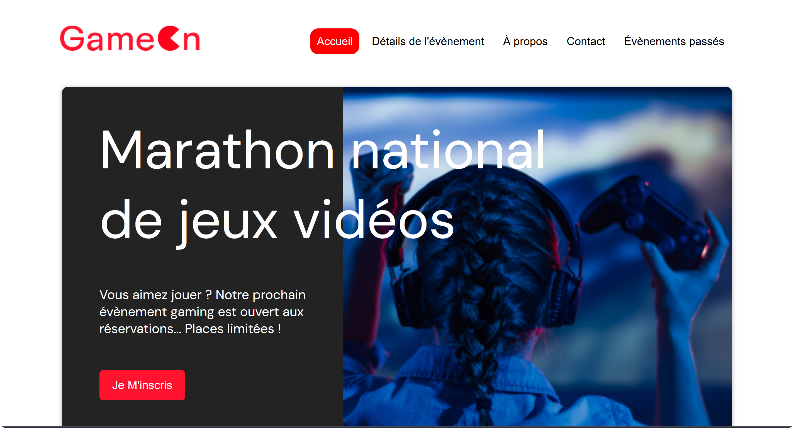

# *GameOn*

  

---

## 📑 Table des matières

- [🎯 Mission](#🎯-mission)
- [🧭 Objectif](#🧭-objectif)
- [✨ Points forts de l’interface](#✨-points-forts-de-linterface)
- [🛠️ Stacks techniques](#🛠️-stacks-techniques)
- [✅ Fonctionnalités et bonnes pratiques](#✅-fonctionnalités-et-bonnes-pratiques)
- [⚙️ Aspects techniques & automatisation](#⚙️-aspects-techniques--automatisation)
- [🔍 Points techniques spécifiques](#🔍-points-techniques-spécifiques)
- [🔗 Accès par clic](#🔗-accès-par-clic)
- [📲 Accès par QR code](#📲-accès-par-qr-code)

---

## 🎯 Mission

Reprendre et finaliser le développement **Front-End** du formulaire d’inscription aux concours de la société **GameOn**, dans une landing page responsive.

Travail réalisé :
- Validation complète des champs,
- Amélioration de l’UX/UI,
- Gestion dynamique de la modale,
- Affichage d’une page de remerciement.

---

## 🧭 Objectif

- Développer une interface moderne et accessible,
- Finaliser la logique JavaScript de validation,
- Assurer une compatibilité mobile/tablette/desktop,
- Structurer le code de manière claire et modulaire.

---

## ✨ Points forts de l’interface

- ✅ Menu **burger responsive**
- ✅ Bloc **Hero** avec slogan et CTA
- ✅ **Modale d’inscription** animée
- ✅ **Formulaire UX-friendly** avec validation en direct
- ✅ **Page de remerciement** élégante

---

## 🛠️ Stacks techniques

| Technologie | Fonction |
|------------|----------|
|  | Structuration sémantique du formulaire |
|  | Responsive design via media queries |
|  | Interactions DOM & validation dynamique |
|  | Expérience fluide et clavier-compatible |
|  | Conception pensée pour les petits écrans |

---

## ✅ Fonctionnalités et bonnes pratiques

- Validation JavaScript complète : prénom, email, date, CGU, etc.
- Utilisation avancée du DOM : `querySelector`, `addEventListener`, etc.
- Gestion d’erreurs personnalisée via `data-error-visible`
- Animations CSS pour la modale
- Feedback utilisateur en temps réel

---

## ⚙️ Aspects techniques & automatisation

- Code modulaire et bien commenté
- Séparation des fichiers : `index.html`, `style.css`, `form.js`
- Responsive jusqu’à **280px**
- Hébergement GitHub Pages

---

## 🔍 Points techniques spécifiques

- Gestion dynamique de l’ouverture/fermeture de la **modale**
- Validation des données **sans rechargement de page**
- Vérification d’âge (18 ans) avec `Date().getFullYear()`
- Comportements différenciés pour **radio / checkbox / input**
- Accessibilité via clavier et lecteurs d’écran

---

## 🔗 Accès par clic

---

## 📲 Accès par QR code

  

